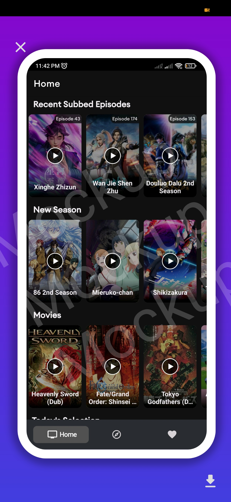
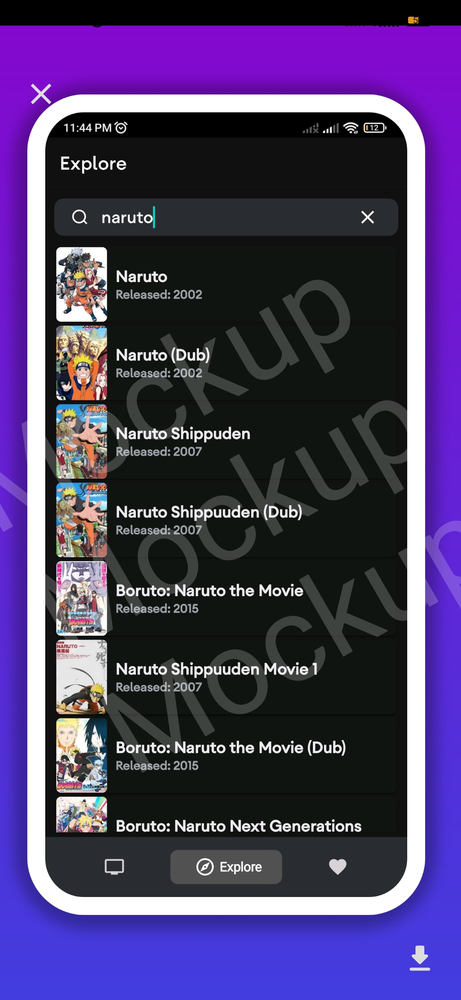
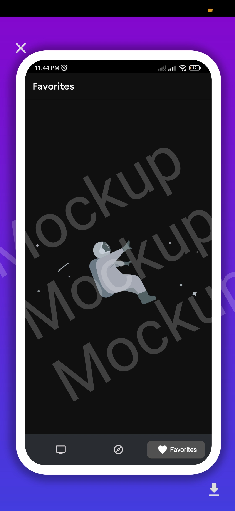

 
<h2 align="center"><b>Animity - Anime Streaming App </b></h2>
<h4 align="center">An Android app to watch anime on your phone without ads.</h4>

<noscript></noscript>

 

<b> Do not PUT ANIMITY OR ANY FORK OF IT INTO GOOGLE PLAYSTORE or Any other Store. It may VIOLATE THEIR TERMS AND CONDITIONS or you may encounter legal obligations.</b>

<h3 align="center">**Star :star:  this repo to show your support and it really does matter!** :clap:</h4>

## Screenshots

## Description

Animity parses website data and filter required info, thus It removes the ads for seamless experience. The app doesn't require account creation to use it.

### Features

* Search Anime
* Recently Added Episodes
* Popular Animes
* Anime Movies

### Coming Features

* Different list of Popular/ Recent / Movies
* Online syncing of Favourite list & watched progress (Will require Login)
* … and many more

### Technologies used
* Kotlin
* MVVM
* Retrofit & Coroutines
* ExoPlayer
* Android Architecture Components
* Coil

## Contribution
Your ideas, translations, design changes, code cleaning, or real heavy code changes or any help is always welcome. The more is contribution the better it gets

[Pull requests](https://github.com/kl3jvi/animity/pulls) will be reviewed

