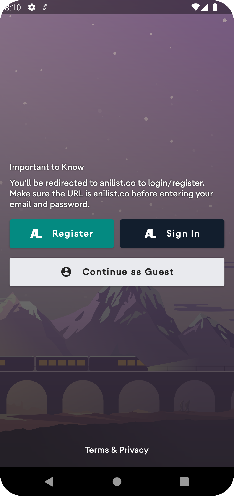
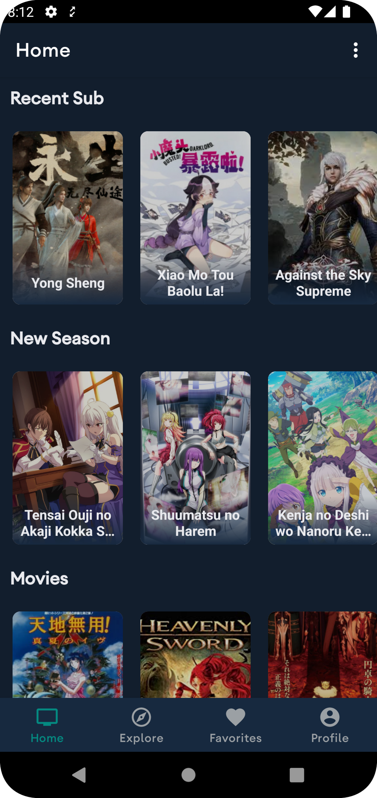
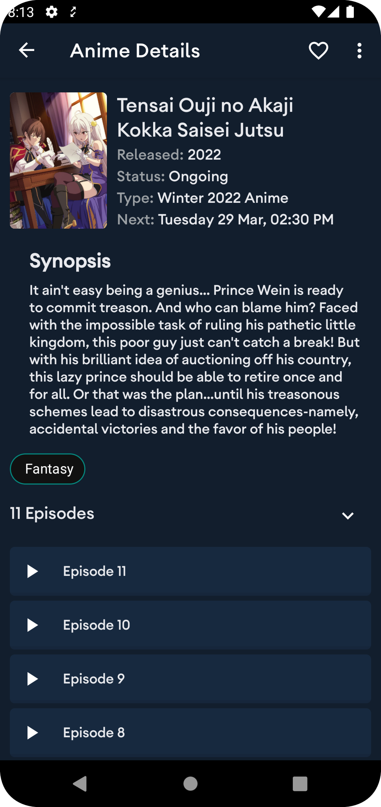
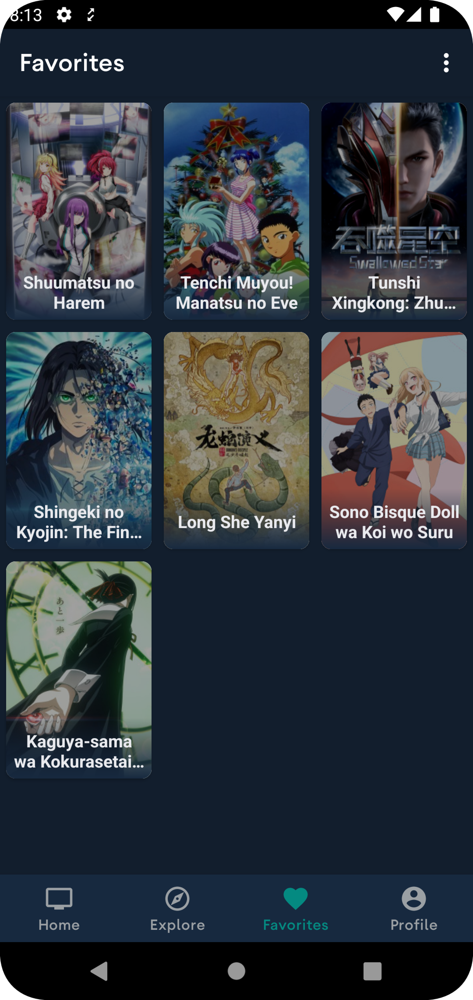
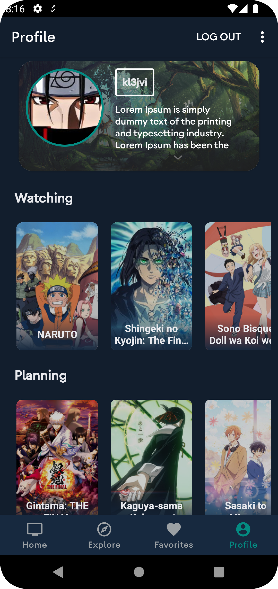
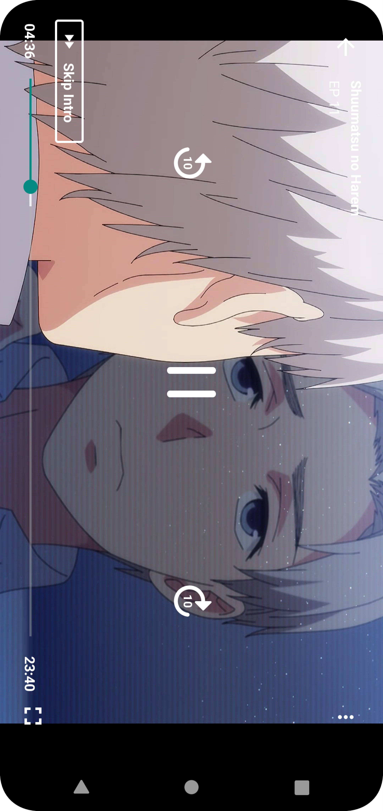

 
<h2 align="center"><b>Animity - Anime Streaming App </b></h2>
<h4 align="center">An Android app to watch anime on your phone without ads.</h4>

<noscript></noscript>

 

<h3 align="center">**Star :star:  this repo to show your support and it really does matter!** :clap:</h4>

Animity is an anime streaming app that provides high-quality streaming of your favorite anime shows. It's designed to be easy to use, so you can quickly find the anime you want to watch and start streaming. With Animity, you can also sync your account with Anilist, so you can keep track of your favorite shows and manage your anime watchlist. Whether you're a die-hard anime fan or a casual viewer, Animity has something for everyone.

**Disclaimer:***

Any legal issues regarding the content on this application should be taken up with the actual file hosts and providers themselves as we are not affiliated with them.

In case of copyright infringement, please directly contact the responsible parties or the streaming websites.

The app is purely for educational and personal use.

Animity does not host any content on the app, and has no control over what media is put up or taken down. Animity functions like any other search engine, such as Google. Animity does not host, upload or manage any videos, films or content. It simply crawls, aggregates and displayes links in a convenient, user-friendly interface.

It merely scrapes 3rd-party websites that are publicly accessable via any regular web browser. It is the responsibility of user to avoid any actions that might violate the laws governing his/her locality. Use Animity at your own risk.

## Screenshots

<!--  -->

## Description

Animity parses website data and filter required info, thus It removes the ads for seamless experience. The app doesn't require account creation to use it.

### Features

* Search Anime
* Recently Added Episodes
* Popular Animes
* Anime Movies

### Coming Features

* Different list of Popular/ Recent / Movies
* Online syncing of Favourite list & watched progress (Will require Login)
* … and many more

### Technologies used
* Kotlin
* MVVM
* Retrofit & Coroutines
* ExoPlayer
* Android Architecture Components
* Coil

## Contribution
Your ideas, translations, design changes, code cleaning, or real heavy code changes or any help is always welcome. The more is contribution the better it gets

[Pull requests](https://github.com/kl3jvi/animity/pulls) will be reviewed

